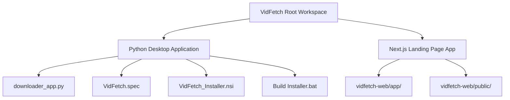

# ⚡ VidFetch

  

  <strong>High-Quality Multi-Threaded Video Downloader for Windows</strong>

  <a href="https://vidfetch.pritamjoardar.com/"><strong>🚀 Visit Production Site: vidfetch.pritamjoardar.com</strong></a>

  
  
  
  

---

VidFetch is an advanced, free, and open-source video downloading suite. It features a high-performance **Python Desktop App** with a sleek dark UI, custom-animated progress bars, and parallel downloads, alongside a modern **Next.js Web Landing Page** to distribute the installer.

🚀 **Live Production Application:** [vidfetch.pritamjoardar.com](https://vidfetch.pritamjoardar.com/)

> [!IMPORTANT]
> **FFmpeg is fully bundled inside the desktop application!**
> Users do not need to install FFmpeg manually or configure environment PATH variables. Everything works out-of-the-box on the first launch.

---

## ✨ Features

### 🖥️ Desktop Application
*   **Parallel Downloads:** Multi-threaded downloader where each URL gets its own progress card and queue thread.
*   **Up to 4K Quality:** Download video streams up to 4K resolution (or select 1080p, 720p, 480p, etc.).
*   **Audio Extraction:** Convert any video to high-quality MP3 format.
*   **Pause & Resume:** Complete control to suspend, resume, or cancel active download tasks.
*   **Metadata & Subtitles:** Automatically download, embed subtitles, and merge video details.
*   **Thumbnail Embedding:** Downloads and embeds the video thumbnail into the audio/video media file.
*   **Proxy Support:** Integrated proxy settings (HTTP/SOCKS5) to bypass regional restrictions.
*   **Interactive Log:** Real-time log console showing detailed network and download stages.

### 🌐 Web Landing Page (`/vidfetch-web`)
*   **Premium Aesthetics:** A stunning glassmorphic dark interface with gradient highlights and micro-animations.
*   **Live Preview Mockup:** High-fidelity interactive CSS application preview showing how the download process works.
*   **SEO Optimized:** Handcrafted with meta descriptions, Google Fonts, and standard HTML structures.
*   **Google Tag Manager (GTM):** Configured via Next.js native Script tags for speed and SEO telemetry.

---

## 📂 Project Structure

### Key Workspace Files
*   [`downloader_app.py`](file:///c:/Users/prita/Desktop/video%20downloaed/downloader_app.py): Core GUI and network controller built using standard Tkinter and `yt-dlp`.
*   [`VidFetch.spec`](file:///c:/Users/prita/Desktop/video%20downloaed/VidFetch.spec): PyInstaller specification configuration to pack the script, resources, and bundled FFmpeg.
*   [`VidFetch_Installer.nsi`](file:///c:/Users/prita/Desktop/video%20downloaed/VidFetch_Installer.nsi): NSIS compiler script that packages the standalone executable into a setup installation program.
*   [`vidfetch-web/`](file:///c:/Users/prita/Desktop/video%20downloaed/vidfetch-web/): Next.js web application root.

## 🚀 Setup & Installation

Getting started with VidFetch is simple and requires no environment configuration:

1. **Download the Installer:** Visit the [VidFetch Production Site](https://vidfetch.pritamjoardar.com/) and click on **Download for Windows** to download `VidFetch_Setup.exe`.
2. **Run Setup:** Double-click the downloaded `VidFetch_Setup.exe` file.
3. **Install:** Follow the step-by-step installer wizard. It will:
   * Install VidFetch to your Program Files.
   * Add a Desktop shortcut.
   * Add a Start Menu entry.
   * Pre-package the bundled FFmpeg environment.
4. **Enjoy:** Launch VidFetch from your desktop and start downloading videos instantly.

> [!TIP]
> **Zero Configuration:** FFmpeg and all necessary dependencies are pre-packaged within the installer. There is no need to manually download FFmpeg or edit your system environment path variables.

---

## ⚙️ Technologies Used

| Technology | Purpose |
| :--- | :--- |
| **Python 3** | Desktop App Core |
| **Tkinter** | Native Desktop GUI Rendering |
| **yt-dlp** | Video Metadata Fetching & Network Engine |
| **FFmpeg** | Video merging, subtitles conversion, and MP3 extraction |
| **Next.js 15+** | Landing Page Web Framework (React/TypeScript) |
| **Vanilla CSS** | Core layout, animations, and typography styles |
| **PyInstaller** | Executable compiler packaging |
| **NSIS (Nullsoft)** | Windows Installer wizard compiler |

---

## 👤 Author

*   **Pritam Joardar** - *Lead Creator* - [Portfolio](http://pritamjoardar.com/)

---

*Made with ⚡ and 🧡 by Pritam Joardar.*
